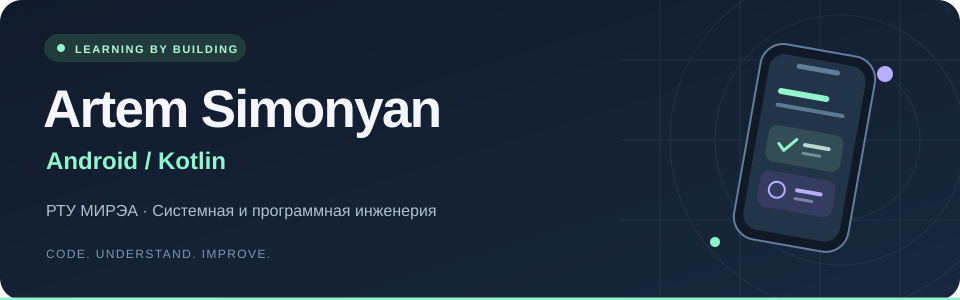
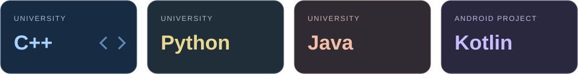
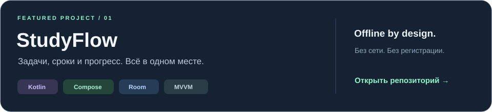
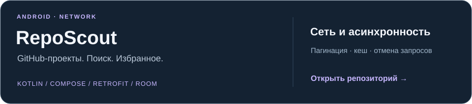
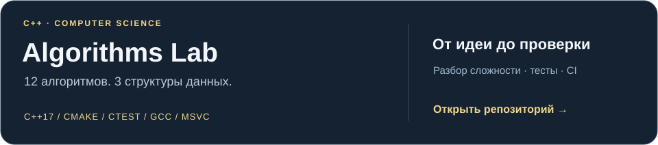

<p align="center">
  
</p>

<p align="center">
  <a href="https://github.com/ASimonyan1/studyflow-android"><b>Android-проект</b></a>
  &nbsp; / &nbsp;
  <a href="https://github.com/ASimonyan1/studyflow-android/blob/main/docs/WALKTHROUGH.md"><b>Архитектура</b></a>
  &nbsp; / &nbsp;
  <a href="mailto:artemsimonan81@gmail.com"><b>Связаться</b></a>
</p>

<br />

### Привет, я Артём

Учусь на **2 курсе РТУ МИРЭА**, направление — «Системная и программная инженерия». Развиваюсь в Android-разработке: мне интересно, как устроены приложения — от интерфейса и состояния до хранения данных и обработки ошибок.

В университете изучаю **C++, Python, Java и СиАОД — структуры и алгоритмы обработки данных**. Эту базу связываю с интересом к мобильной разработке: хочу понимать и пользовательский интерфейс, и алгоритмы, и работу приложения с данными.

**Сейчас ищу:** стажировку по Android-разработке, где смогу решать практические задачи и учиться у команды.

<p>
  
</p>

<br />

### 01 / Проекты

<a href="https://github.com/ASimonyan1/studyflow-android">
  
</a>

<p>
  <a href="https://github.com/ASimonyan1/studyflow-android/actions/workflows/android.yml"></a>
</p>

Создание и редактирование задач, поиск по предмету, фильтры и контроль сроков. Данные хранятся локально в Room; интерфейс получает обновления через Flow и ViewModel.

**[Код →](https://github.com/ASimonyan1/studyflow-android)** &nbsp; · &nbsp; **[Сборки и APK →](https://github.com/ASimonyan1/studyflow-android/actions)** &nbsp; · &nbsp; **[Как устроен проект →](https://github.com/ASimonyan1/studyflow-android/blob/main/docs/WALKTHROUGH.md)**

<sub>Учебный прототип подготовлен с помощью AI-инструментов. Возможности, ограничения и проверки описаны в README проекта.</sub>


<br />

<a href="https://github.com/ASimonyan1/reposcout-android"></a>

[](https://github.com/ASimonyan1/reposcout-android/actions)

Поиск через GitHub API, отмена устаревших запросов, страницы результатов и локальное избранное. При ошибке сети — кеш с отметкой времени. Тесты HTTP через MockWebServer и сценарии ViewModel с виртуальным временем.

**[Код →](https://github.com/ASimonyan1/reposcout-android)** · **[Проверки и APK →](https://github.com/ASimonyan1/reposcout-android/actions)**

<br />

<a href="https://github.com/ASimonyan1/algorithms-lab"></a>

[](https://github.com/ASimonyan1/algorithms-lab/actions)

Бинарный поиск, сортировка слиянием, BFS/DFS, динамическое программирование, очередь, стек с минимумом и хеш-таблица. Граничные случаи, сравнение с эталонными решениями, проверки на Linux и Windows, AddressSanitizer и UBSan.

**[Код →](https://github.com/ASimonyan1/algorithms-lab)** · **[Разборы →](https://github.com/ASimonyan1/algorithms-lab/blob/main/docs/NOTES.md)** · **[Тесты →](https://github.com/ASimonyan1/algorithms-lab/actions)**

<sub>Все три проекта — учебная практика, подготовленная с помощью AI-инструментов. Реализованные возможности, ограничения и способы проверки описаны в каждом репозитории.</sub>

<br />

### 02 / Университетская база

**РТУ МИРЭА · 2 курс · Системная и программная инженерия**

| Направление | Моя подготовка |
| :--- | :--- |
| **C++** | Изучаю в рамках университетской подготовки по программированию. |
| **Python** | Один из языков моей учебной практики. |
| **Java** | Изучаю в университете; хочу углублять знания в связи с Android-разработкой. |
| **СиАОД** | Структуры и алгоритмы обработки данных — часть моей университетской подготовки. |
| **Программная инженерия** | Интересуют ООП, организация кода, архитектура приложений и работа с данными. |

<br />

### 03 / Android: от теории к проекту

Технологии, с которыми разбираюсь на примере **StudyFlow** и **RepoScout**:

| Слой | Технологии | Что реализовано в проекте |
| :--- | :--- | :--- |
| **Интерфейс** | Jetpack Compose · Material 3 | Список задач, редактор, поиск, фильтры, светлая и тёмная темы |
| **Состояние** | ViewModel · Coroutines · Flow | Получение обновлений из базы и передача состояния в UI |
| **Данные** | Room · SQLite | Локальное хранение и работа без интернета |
| **Структура** | MVVM · Repository | Разделение интерфейса, состояния и операций с данными |
| **Сеть** | Retrofit · OkHttp · GitHub API | Поиск, пагинация, отмена запросов и обработка ошибок в RepoScout |
| **Кеш** | Room · JSON | Сохранение страниц поиска и локальное избранное в RepoScout |
| **Качество** | JUnit · MockWebServer · Compose UI Test · Android Lint | JVM-тесты, HTTP-сценарии и проверка StudyFlow на эмуляторе |
| **Сборка** | Gradle · GitHub Actions | Автоматическая сборка debug APK и запуск проверок |

**Инженерные вопросы, которые мне интересны:** как выбирать структуру данных под задачу, сохранять состояние при повороте экрана, обрабатывать ошибки и проверять граничные случаи.

<br />

### 04 / Куда развиваюсь

- **Android:** глубже разобраться с жизненным циклом, управлением состоянием и асинхронной работой.
- **Алгоритмы:** укреплять университетскую базу и учиться оценивать сложность решений.
- **StudyFlow:** добавить напоминания и экспорт, расширить UI-тесты.
- **Работа с данными:** изучить синхронизацию и разрешение конфликтов при изменениях без сети.

<details>
<summary><b>Заглянуть внутрь StudyFlow</b></summary>

<br />

```text
Jetpack Compose UI
        ↓ действия     ↑ состояние
      ViewModel + Flow
             ↕
        Repository
             ↕
        Room / SQLite
```

[Разбор архитектуры и вопросы по коду](https://github.com/ASimonyan1/studyflow-android/blob/main/docs/WALKTHROUGH.md) · [Сценарии проверки приложения](https://github.com/ASimonyan1/studyflow-android/blob/main/docs/TESTING.md)

</details>

---

<p align="center">
  <b>Обсудим Android?</b><br />
  <a href="mailto:artemsimonan81@gmail.com">artemsimonan81@gmail.com</a>
  &nbsp; · &nbsp;
  <a href="https://github.com/ASimonyan1">@ASimonyan1</a>
</p>
